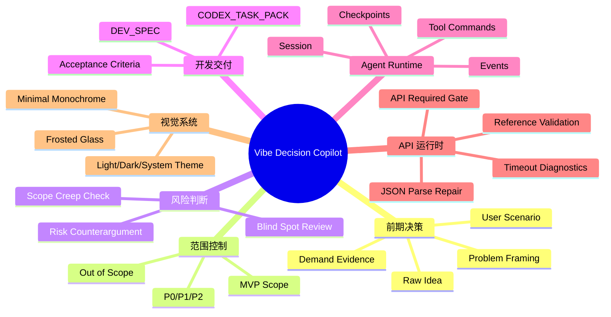
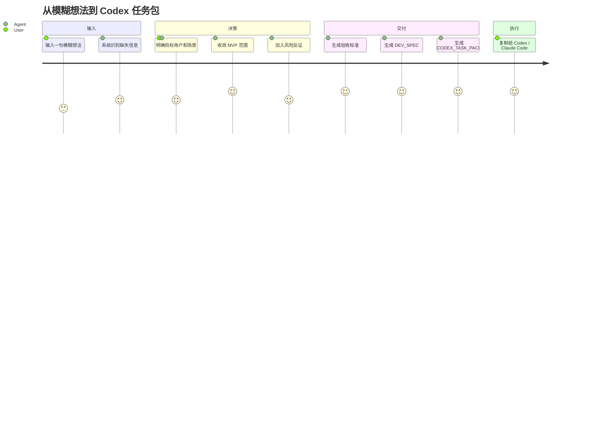
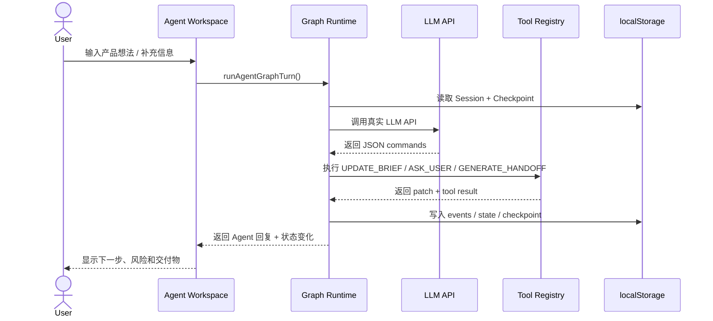
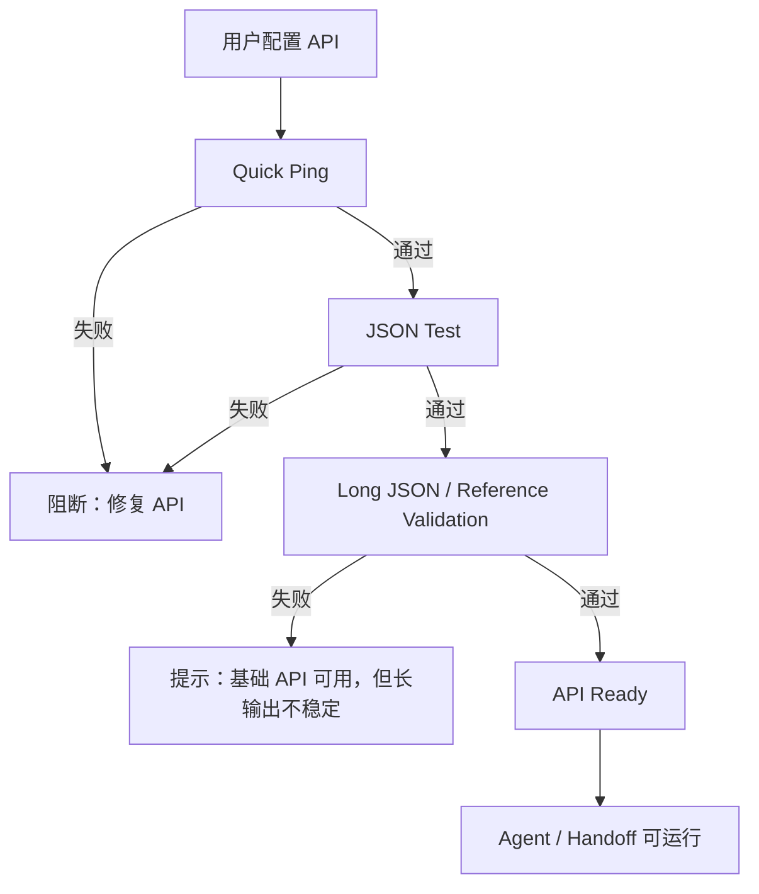
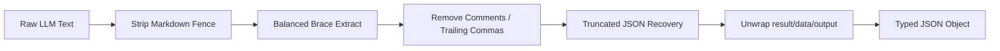
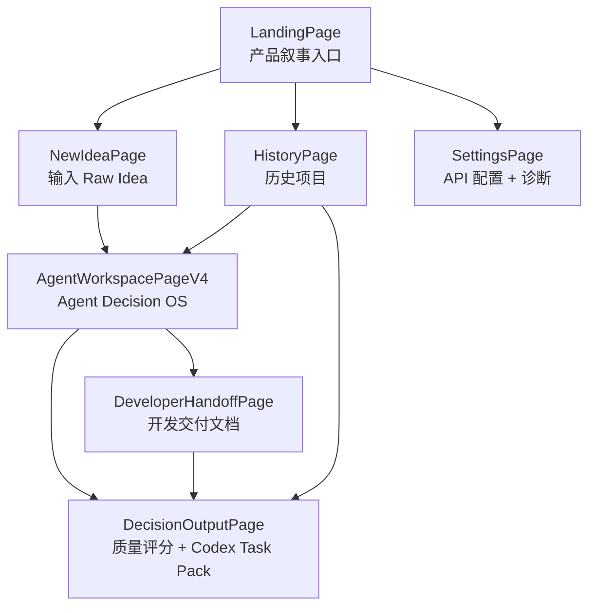

# Vibe Decision Copilot

> **把模糊产品想法转化为 Codex 可执行任务包的前期决策 Agent**  
> Think before Codex writes.

<p align="center">
  
  
  
  
</p>

---

## 01｜这个项目一句话是什么？

**Vibe Decision Copilot** 是一个面向 vibe coding 新手的前期决策工具。  
它不直接替用户写代码，而是在 AI 写代码之前，先帮助用户把一句模糊想法整理成：

```text
可判断的问题定义
→ 可收敛的 MVP 范围
→ 可验证的验收标准
→ 可交给 Codex / Claude Code / Cursor 执行的开发任务包
```

如果把 AI 编程比作“让一个很强的施工队开始盖房子”，那这个项目做的不是施工，而是：

```text
先确认你到底要盖什么房子
谁住
为什么要盖
第一期只盖哪些房间
哪些暂时不盖
什么样算验收合格
最后把图纸交给施工队
```

---

## 02｜为什么要做它？

很多 vibe coding 项目失败，不是因为 AI 不会写代码，而是因为人在开始前没有想清楚：

| 常见问题 | 最终结果 |
|---|---|
| “我想做一个 AI 工具”太模糊 | AI 只能生成玩具 Demo |
| 没想清楚目标用户 | 页面有了，但没人真的需要 |
| 没有 MVP 范围 | 第一版越做越大，最后失控 |
| 没有反证和风险判断 | 项目看起来完整，但逻辑不成立 |
| 没有验收标准 | Codex 不知道做到什么程度算完成 |
| Prompt 太散 | AI 编程工具执行不稳定 |

**Vibe Decision Copilot 的核心价值：**

> 在 AI 写代码之前，先把“想法”变成“规格”，再把“规格”变成“任务包”。

---

## 03｜项目核心闭环


### 从“雾”到“图纸”

```text
Raw Idea：        一团雾        “我想做一个雅思小程序”
Problem：         轮廓出现      “雅思学生复盘生词和错题很分散”
Scenario：        场景落地      “做完剑桥真题后整理词块、同替和错因”
MVP：             削掉多余      “只做词库 + 错题 + 复盘闭环，不做社区/支付/登录”
Acceptance：      标尺出现      “用户能新增、分类、导出、复盘，才算完成”
CODEX_TASK_PACK： 图纸完成      “Codex 可以按步骤改代码”
```

---

## 04｜它不是普通 PRD 生成器

| 对比项 | 普通 PRD 生成器 | Vibe Decision Copilot |
|---|---|---|
| 工作方式 | 一次性生成文档 | 分阶段决策 + 人类确认 |
| 重点 | 文档看起来完整 | 需求是否值得做、能否执行 |
| 风险处理 | 往往缺失 | 强制加入反证和盲点 |
| MVP 控制 | 容易大而全 | P0 / P1 / P2 / Out of Scope |
| 面向对象 | 产品文档阅读者 | AI Coding 执行工具 |
| 最终交付 | PRD 文本 | DEV_SPEC + CODEX_TASK_PACK |

一句话：

> 普通 PRD 生成器像“帮你写作文”；Vibe Decision Copilot 像“帮你把项目从想法审成施工图”。

---

## 05｜核心功能地图



---

## 06｜用户旅程



---

## 07｜10 阶段决策管道

| 进度 | 阶段 | 它在问什么 | 产出 |
|---:|---|---|---|
| 10% | Raw Idea | 你想做什么？ | 原始想法、项目类型 |
| 20% | Problem Framing | 真正问题是什么？ | 问题定义、痛点边界 |
| 30% | User Scenario | 谁在什么场景下用？ | 用户画像、使用场景 |
| 40% | Demand Evidence | 凭什么说它值得做？ | 需求证据、替代方案 |
| 55% | MVP Scope | 第一版只做什么？ | P0 / P1 / P2 / Out of Scope |
| 65% | Risk Counterargument | 什么证据能证明你错了？ | 风险、反证、失败条件 |
| 75% | Tech Constraints | 最低成本怎么实现？ | 技术栈、数据结构、边界 |
| 85% | Acceptance Criteria | 做到什么算完成？ | 可测试验收标准 |
| 95% | DEV_SPEC | 代码前的规格是什么？ | 开发规格文档 |
| 100% | CODEX_TASK_PACK | Codex 怎么执行？ | 文件计划、步骤、测试、禁止项 |

```text
Raw Idea              [█---------] 10%
Problem Framing       [██--------] 20%
User Scenario         [███-------] 30%
Demand Evidence       [████------] 40%
MVP Scope             [██████----] 55%
Risk Counterargument  [███████---] 65%
Tech Constraints      [████████--] 75%
Acceptance Criteria   [█████████-] 85%
DEV_SPEC              [██████████] 95%
CODEX_TASK_PACK       [██████████] 100%
```

---

## 08｜Agent Graph Runtime 是什么？

项目中有一个前端 Agent Graph Runtime。它不是“聊天框套 API”，而是维护一套可追踪的决策状态：



### Runtime 里真正保存什么？

| 对象 | 作用 | 为什么重要 |
|---|---|---|
| Session | 当前项目的 Agent 工作流状态 | 刷新后能恢复 |
| Event Log | 每次用户输入、AI 调用、工具执行 | 可观察、可调试 |
| Checkpoint | 关键节点快照 | 后续可回退 |
| Command | Agent 产生的动作 | 不是只说话，而是执行 |
| Tool Result | 工具执行结果 | 能判断成功/失败 |
| Pending Questions | 等待用户确认的信息 | Human-in-the-loop |

---

## 09｜API Required Runtime：不做假数据

Vibe Decision Copilot 的核心生成依赖真实 LLM API。  
如果 API 没配置、连接失败、JSON 失败或校验失败，系统不会用 mock 或本地规则冒充结果。



这样做的原因：

> 对 AI 产品来说，最可怕的不是失败，而是假装成功。

---

## 10｜结构化输出：为什么要修 JSON？

LLM 很容易返回：

```text
好的，下面是 JSON：
```json
{ ... }
```
```

或者返回半截 JSON、包在 `data/result/output` 里、甚至出现多余解释。  
项目实现了多层 JSON 解析和修复机制，让 Agent 输出尽量能被程序消费。



---

## 11｜CODEX_TASK_PACK 长什么样？

最终不是一段泛泛的 Prompt，而是一份可执行任务包：

```text
CODEX_TASK_PACK
├── Context：当前项目背景
├── Objective：本轮要实现什么
├── Constraints：不能改什么
├── File Plan：预计修改哪些文件
├── Implementation Steps：分步骤执行
├── Acceptance Tests：验收测试
├── Forbidden Changes：禁止事项
└── Progress Checklist：带百分比的执行清单
```

示例：

```text
[10%] Audit current project structure
[25%] Implement data model
[45%] Implement UI flow
[65%] Implement validation
[85%] Run lint and build
[100%] Verify acceptance criteria
```

这就是它和普通“帮我写代码”Prompt 的区别。

---

## 12｜页面结构



---

## 13｜技术架构

| 层级 | 技术 | 说明 |
|---|---|---|
| 前端 | React + TypeScript + Vite | 单页应用，适合快速迭代 |
| 路由 | React Router | 多页面流程与工作台 |
| 样式 | Tailwind + CSS Variables | 黑白灰 / iOS-like / 磨砂玻璃 |
| 状态 | React State + localStorage | 本地项目历史、Session、API 设置 |
| Agent | agent-v4 Graph Runtime | Session / Events / Commands / Tools |
| API | OpenAI-compatible Proxy | 同源代理转发，避免浏览器直连问题 |
| 输出 | DEV_SPEC / CODEX_TASK_PACK | 面向 AI coding 工具的交付物 |
| 部署 | Vercel / GitHub Pages 倾向 | 前端静态 + Serverless API Proxy |

---

## 14｜项目目录速览

```text
vibe-product-framing-web/
├── api/
│   └── ai-proxy.ts                  # OpenAI-compatible API 代理
│
├── src/
│   ├── agent-v4/                    # Agent Graph Runtime
│   │   ├── graphRuntime.ts          # Agent 主运行时
│   │   ├── graphStore.ts            # Session 持久化
│   │   ├── eventLog.ts              # Event 记录
│   │   ├── slotFilling.ts           # 信息槽填充
│   │   ├── questionLedger.ts        # 追问记录与防重复
│   │   ├── nodes/                   # Agent 节点
│   │   ├── tools/                   # Tool Registry
│   │   └── ui/                      # Agent UI 组件
│   │
│   ├── api/
│   │   ├── evaluate.ts              # LLM 调用、JSON 修复、校验
│   │   ├── apiHealth.ts             # API 健康状态
│   │   └── timeoutProfile.ts        # API 超时策略
│   │
│   ├── pages/
│   │   ├── LandingPage.tsx          # 首页
│   │   ├── NewIdeaPage.tsx          # 新想法输入
│   │   ├── AgentWorkspacePageV4.tsx # Agent 工作台
│   │   ├── DecisionOutputPage.tsx   # 决策输出
│   │   ├── DeveloperHandoffPage.tsx # 开发交付
│   │   ├── SettingsPage.tsx         # API 设置
│   │   └── HistoryPage.tsx          # 历史记录
│   │
│   ├── lib/                         # 质量评分、歧义检测、EARS、Task Pack
│   ├── components/                  # 通用组件
│   ├── components/liquid/           # 磨砂玻璃 UI 组件
│   ├── hooks/                       # React hooks
│   ├── types.ts                     # 全局类型
│   └── index.css                    # 全局设计系统
│
├── vercel.json
├── vite.config.ts
└── package.json
```

---

## 15｜快速开始

```bash
# 1. 安装依赖
npm install

# 2. 启动开发环境
npm run dev

# 3. 构建
npm run build

# 4. Lint
npm run lint
```

打开：

```text
http://localhost:5173
```

---

## 16｜配置 API

进入：

```text
/settings
```

推荐按三步测试：

| 测试 | 作用 | 失败说明 |
|---|---|---|
| Quick Ping | 检查 API 是否能快速返回 | 网络、Key、模型名或代理问题 |
| JSON Test | 检查模型能否返回小 JSON | 模型格式遵循能力不足 |
| Long JSON Test | 检查复杂结构化输出能力 | 长文本生成慢或不稳定 |

> 如果 Quick Ping 通过但 Long JSON 超时，说明 API 不一定坏了，可能只是模型生成长 JSON 太慢。

---

## 17｜视觉设计语言

当前 UI 方向是：

```text
Less, but clearer.
少即是多，但信息必须清楚。
```

| 设计层 | 处理方式 |
|---|---|
| 色彩 | 黑 / 白 / 灰为主，少量系统蓝强调 |
| 卡片 | 圆角磨砂玻璃，不堆叠过度透明层 |
| 动效 | 轻微 hover / fade / progress transition |
| 主题 | system / light / dark 三模式 |
| 信息层级 | 大标题、分区、卡片、状态徽章统一 |
| 可访问性 | 保证对比度，支持 reduced motion |

---

## 18｜一个具体例子

用户输入：

```text
我想做一个雅思生词和错题管理小程序
```

系统不会直接说“好的，开始写代码”。

它会先拆：

```text
目标用户：正在备考雅思、刷剑桥真题的学生
使用场景：做完阅读/听力后整理生词、同义替换和错题原因
核心问题：记录分散，复盘没有结构，无法沉淀高频错因
P0 功能：词库、错题、同替记录、复盘导出
暂不做：登录、社区、支付、AI 自动批改、复杂后台
验收标准：用户能新增、分类、搜索、导出，并完成一次复盘闭环
Codex 任务：创建数据结构、页面、交互、导出逻辑、测试清单
```

最终交付给 Codex 的不再是一句话，而是一份可执行规格。

---

## 19｜面试讲述方式

可以这样介绍：

> 我做的不是普通 PRD 生成器，而是一个面向 vibe coding 的前期决策 Agent。很多人用 Codex / Claude Code 写代码时失败，不是因为 AI 不会写，而是因为开发前需求不清、范围不收敛、验收标准缺失。这个项目把模糊想法转成 Problem Framing、User Scenario、MVP Scope、Risk Counterargument、Acceptance Criteria、DEV_SPEC 和 CODEX_TASK_PACK，让 AI coding 工具在更明确的规格下执行。

如果面试官追问“技术难点是什么”：

```text
1. 如何让 LLM 稳定返回结构化 JSON
2. 如何判断输出是否真的基于用户当前想法
3. 如何避免 Agent 重复追问同一问题
4. 如何把聊天结果转成可执行 command / tool result
5. 如何在 API 失败时不生成假结果
6. 如何把产品决策转成 Codex 能执行的任务包
```

---

## 20｜当前版本关键词

```text
Vibe Decision Copilot
Spec-driven Development
Agent Graph Runtime
Human-in-the-loop
API Required Runtime
Requirement Quality Score
Ambiguity Detection
MVP Scope Control
Risk Counterargument
EARS Acceptance Criteria
DEV_SPEC
CODEX_TASK_PACK
Minimal Apple Monochrome UI
```

---

## 21｜Roadmap

| 阶段 | 方向 | 目标 |
|---|---|---|
| P0 | 前期决策闭环 | Raw Idea → CODEX_TASK_PACK 全流程稳定 |
| P1 | Agent 交互质量 | 更自然追问、更少重复、更强上下文感知 |
| P1 | API 诊断 | 更清晰的 timeout / JSON / validation 分层错误 |
| P2 | Real RAG | 接入产品案例、PRD 模板、架构模板检索 |
| P2 | MCP Server | 让 Codex / Claude 直接调用 Vibe Decision Copilot 工具 |
| P2 | 多模型评测 | 对比不同模型生成 DEV_SPEC 的质量 |
| P3 | 团队协作 | 账号、云端存储、协作评审、版本 diff |

---

## 22｜License

MIT

---

> Built for people who want to vibe code, but refuse to ship toy demos.
