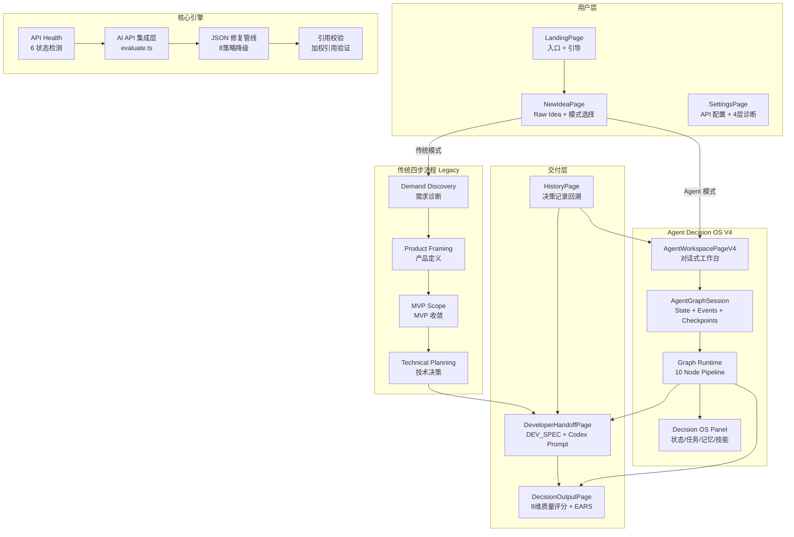
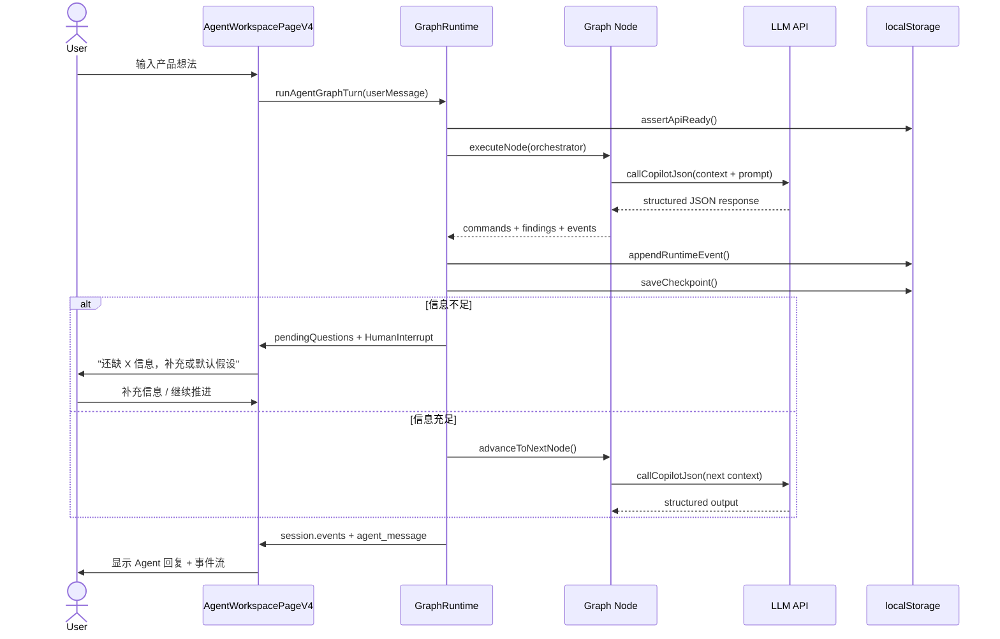

# Vibe Decision Copilot V4.9

> **AI 驱动的前置产品决策 Agent** — 把模糊产品想法转化为 Codex 可执行任务包
>
> 不是 PRD 生成器，而是 10 阶段结构化决策工作流 + Agent Graph Runtime + 真实 LLM API

<p align="center">
  
  
  
  
  
</p>

---

## 🎯 一句话定位

**Vibe Decision Copilot** 解决 AI 辅助软件开发中最被忽视的一环：**写代码之前的决策质量**。它通过 10 个阶段的结构化对话 + 多 Agent 图工作流，把"我想做一个 XX"转化为包含 DEV_SPEC 和 CODEX_TASK_PACK 的可执行任务包，直接交给 Cursor / Claude Code / GitHub Copilot 执行。

---

## 🏗️ 系统架构



---

## 🔄 Agent Graph Runtime 工作流



---

## 📋 10 阶段决策管道

```mermaid
flowchart LR
    A([Raw Idea]) --> B[Intake<br/>信息收集]
    B --> C[Demand<br/>需求诊断]
    C --> D[Product<br/>产品定义]
    D --> E[MVP<br/>范围收敛]
    E --> F[Tech<br/>技术决策]
    F --> G[Data<br/>数据模型]
    G --> H[Risk<br/>风险评估]
    H --> I[Review<br/>盲点审查]
    I --> J[Handoff<br/>开发交付]
    J --> K([DEV_SPEC +<br/>CODEX_TASK_PACK])

    style A fill:#007aff,color:#fff
    style K fill:#34c759,color:#fff
    style B fill:#f5f5f7,color:#111
    style C fill:#f5f5f7,color:#111
    style D fill:#f5f5f7,color:#111
    style E fill:#f5f5f7,color:#111
    style F fill:#f5f5f7,color:#111
    style G fill:#f5f5f7,color:#111
    style H fill:#f5f5f7,color:#111
    style I fill:#f5f5f7,color:#111
    style J fill:#f5f5f7,color:#111
```



| 阶段 | 节点 | 核心问题 | 输出物 |
|------|------|---------|--------|
| 0 | Intake | 产品想法是什么？ | rawIdea, projectType, targetUser, scenario |
| 1 | Demand | 这个需求真实吗？ | 需求证据, 目标用户画像, 痛点分析 |
| 2 | Product | 怎么一句话定义？ | 产品一句话, 价值假设, AI 介入价值 |
| 3 | MVP | 第一版只验证哪个闭环？ | Must Have / Should Have / Out of Scope |
| 4 | Tech | 最低成本技术方案？ | 前后端框架, 数据库, AI API 策略 |
| 5 | Data | 数据结构怎么设计？ | 实体模型, 数据流, API 设计 |
| 6 | Risk | 有什么风险？ | 需求/业务/技术/范围风险 |
| 7 | Review | 有没有遗漏？ | 盲点审查, 边界条件, 竞品盲区 |
| 8 | Handoff | 可以交给 Codex 了吗？ | DEV_SPEC, CODEX_TASK_PACK, 验收标准 |

---

## 🎨 UI 设计系统 (V4.9 Apple Monochrome)

```mermaid
graph TD
    subgraph "设计原则"
        P1[Minimal<br/>最小化装饰]
        P2[Monochrome<br/>黑白灰 + 蓝色]
        P3[iOS Pill<br/>999px 圆角统一]
        P4[Theme<br/>system/light/dark]
    end

    subgraph "组件体系"
        C1[统一卡片<br/>vp-card / vp-panel]
        C2[统一按钮<br/>vp-btn / vp-btn-primary / ghost / text]
        C3[统一输入<br/>vp-input / vp-textarea]
        C4[Segmented Control<br/>iOS 分段选择器]
        C5[Liquid 组件<br/>Card / Button / Badge / Progress / Dock]
        C6[Status 指示<br/>Badge / Chip / Progress]
    end

    subgraph "Token 体系"
        T1[--vp-bg: #f5f5f7]
        T2[--vp-text: #111111]
        T3[--vp-border: rgba(0,0,0,.08)]
        T4[--vp-accent: #007aff]
        T5[--vp-radius-pill: 999px]
        T6[--vp-blur: 22px]
    end

    P1 --> C1
    P2 --> T1
    P3 --> C2
    P4 --> C6
```

| Token | Light | Dark | 用途 |
|-------|-------|------|------|
| `--vp-bg` | `#f5f5f7` | `#000` | 页面背景 |
| `--vp-surface` | `rgba(255,255,255,.76)` | `rgba(28,28,30,.74)` | 卡片/面板 |
| `--vp-text` | `#111` | `#f5f5f7` | 主文字 |
| `--vp-accent` | `#007aff` | `#0a84ff` | 强调色 |
| `--vp-border` | `rgba(0,0,0,.08)` | `rgba(255,255,255,.10)` | 边框 |
| `--vp-radius-pill` | `999px` | `999px` | iOS 圆角 |

---

## 📁 项目结构

```
vibe-product-framing-web/
├── api/
│   └── ai-proxy.ts                # Vercel Edge / Vite dev proxy
├── src/
│   ├── agent-v4/                   # 🧠 Agent Graph Runtime
│   │   ├── graphRuntime.ts         # 图执行引擎 + AI 调用
│   │   ├── graph.ts                # 图定义 (节点 + 边)
│   │   ├── graphStore.ts           # Session 持久化 (localStorage)
│   │   ├── slotFilling.ts          # 信息槽填充状态机
│   │   ├── questionLedger.ts       # 追问防止重复
│   │   ├── defaultAssumptions.ts   # 默认假设规则引擎
│   │   ├── turnLifecycle.ts        # Agent 回合生命周期
│   │   ├── immediateReply.ts       # 即时确认回复
│   │   ├── nodes/                  # 10 个 Graph Node
│   │   ├── tools/                  # 11 个 Agent Tool
│   │   ├── ui/                     # Agent UI 组件 (10个)
│   │   ├── adapters/               # MCP-like 工具适配器
│   │   └── types.ts                # Agent 类型定义
│   │
│   ├── api/
│   │   ├── evaluate.ts             # AI 集成核心 (~2100行)
│   │   └── apiHealth.ts            # API 6状态健康检测
│   │
│   ├── pages/                      # 17 页面组件
│   │   ├── LandingPage.tsx         # 首页 + 引导
│   │   ├── NewIdeaPage.tsx         # 创建新想法
│   │   ├── AgentWorkspacePageV4.tsx# Agent 工作台 (核心)
│   │   ├── DecisionOutputPage.tsx  # 决策输出 + 评分
│   │   ├── DeveloperHandoffPage.tsx# 开发交付
│   │   ├── SettingsPage.tsx        # API 配置 + 诊断
│   │   ├── HistoryPage.tsx         # 历史记录
│   │   └── *Page.tsx               # 其他流程页面
│   │
│   ├── prompts/                    # LLM Prompt 工程
│   ├── knowledge/                  # 知识库 (Pseudo-RAG)
│   ├── evaluation/                 # 5维质量评分引擎
│   ├── spec/                       # DEV_SPEC 结构化
│   ├── trace/                      # 生成追溯
│   ├── snapshot/                   # 版本快照对比
│   ├── export/                     # 案例导出
│   ├── components/                 # 通用组件
│   │   ├── liquid/                 # 10 个 Liquid 组件
│   │   ├── ThemeToggle.tsx         # 主题切换
│   │   └── ApiRequiredGate.tsx     # API 就绪门禁
│   ├── hooks/                      # React Hooks
│   ├── lib/                        # 工具库
│   ├── index.css                   # 设计系统 (~1000行 CSS)
│   ├── types.ts                    # 全局类型 (~300行)
│   ├── main.tsx                    # 入口
│   └── App.tsx                     # 路由 + ErrorBoundary
│
├── vercel.json                     # SPA + API 路由
├── vite.config.ts                  # localAiProxy middleware
└── package.json
```

---

## 🚀 快速开始

```bash
# 安装依赖
npm install

# 启动开发服务器
npm run dev          # → http://localhost:5173

# 生产构建
npm run build        # → dist/

# 类型检查
npx tsc --noEmit     # 零错误

# Lint
npm run lint         # 零错误
```

### 配置 AI API

1. 打开 `http://localhost:5173/settings`
2. 选择 Provider（OpenAI / DeepSeek / GLM）
3. 填入 API URL + Key + Model
4. 点击 **测试连接（短）** → 通过后 → **测试长 JSON 生成**
5. 4 层诊断全部通过 → API Ready ✅
6. 返回首页，点击 **"第一步：开始配置"** 或 **"开始使用"**

---

## 🧪 工程亮点

### 1. Agent Graph Runtime (V4.0)

基于 LangGraph 理念的纯前端 Agent 状态图引擎：

- **State/Events/Checkpoints** 三位一体的持久化 session
- **10 个专职 Node** — 每个独立执行，输出 commands + findings
- **Human-in-the-Loop** — AgentInterruptCard + pendingQuestions
- **4 层记忆系统** — Working / Episodic / Semantic / Skill Library
- **Tool Registry** — 11 个 Agent Tool, MCP-like 适配器

### 2. 8 策略 JSON 修复管线

LLM 输出经常不标准。项目实现 8 层降级策略：

```
1. 直接 JSON.parse
2. 剥离 ``` 围栏后 parse
3. 花括号平衡匹配 + 剥离围栏
4. 全部修复 (注释+逗号+围栏)
5. 平衡括号 + 全部修复
6. 截断恢复 (自动补全未闭合括号)
7. 平衡匹配 + 截断恢复
8. 贪婪正则 + 修复 (最终兜底)
```

配合 `unwrapJsonPayload()` 自动剥离常见包裹模式。

### 3. 加权引用校验

不只是检查关键词出现，而是：

- **权重系统**：rawIdea=3pts, targetUser/scenario/problem=2pts, projectType=1pt
- **多通道检查**：referenceEvidence + JSON 全文 + 长内容字段
- **自适应阈值**：根据输入字段数量动态调整

### 4. API 运行时锁定 (V4.4)

- `assertApiReady()` 门禁 — AI 调用前强制检查 API 健康状态
- `ENABLE_MOCK_FALLBACK = false` — 彻底移除 mock 回退路径
- `ApiRequiredGate` 组件 — API 未就绪时阻断页面 + 引导配置
- AI 失败 → `status='failed'`，不做假数据填充

### 5. 运行时一致性修复 (V4.5)

- 事件双重写入：`appendRuntimeEvent()` 确保 `session.events` 持久化
- Action intent 回复回写：continue/skip/assume → durable `agent_message`
- AI call 事件可见性：`ai_call_started/completed/failed` 在 UI 展示
- DecisionOutput 副作用修复：`useMemo` → `useEffect` + `useRef` 守卫

### 6. Liquid Glass 视觉系统 (V4.6)

- 10 个 Liquid 组件（Card / Button / Input / Badge / Progress / StepRail / Dock / Shell / Aurora / PageReveal）
- `backdrop-filter: saturate(180%) blur()` 玻璃效果
- 可访问性：`prefers-reduced-motion` / `prefers-contrast` / `@supports` fallback

### 7. Apple Monochrome 设计系统 (V4.8-V4.9)

- 多色 → 黑白灰 + accent blue，CSS 减少 15%
- Theme 三模式：system / light / dark
- iOS pill 圆角统一 (999px)
- 统一卡片/按钮/输入框体系

### 8. SPEC Quality Loop

```
生成 → 5维加权评分 → 自动修复 → 再评分 → Snapshot 对比 → 案例导出
```

---

## 📊 技术栈

| 层次 | 技术 | 说明 |
|------|------|------|
| Language | TypeScript 5 | 全量类型覆盖 |
| UI | React 19 + Vite 8 | 最新版本 |
| Styling | Tailwind CSS v4 + CSS Components | 1000行设计系统 |
| Routing | React Router v6 | SPA 路由 |
| State | React Context + localStorage | 纯前端持久化 |
| AI | OpenAI-compatible API | 同源代理转发 |
| Proxy | Vite dev middleware + Vercel Edge | 双环境代理 |
| Icons | lucide-react | 1500+ 图标 |
| Lint | ESLint | 零错误 |
| Deploy | Vercel (自动) | push → deploy |

---

## 📝 版本历史

| 版本 | 日期 | 核心变更 |
|------|------|---------|
| V1.0 | 2026 Q1 | 结构化 AI 生成器，四步流程 MVP |
| V1.6 | — | VibeAIError 分类 + 加权引用校验 + 8策略JSON |
| V1.7 | — | MVP 快速通道 (compact context + light prompt) |
| V2.0 | — | Agentic Workflow — 从页面驱动到 Agent 状态机 |
| V2.1 | — | 工作流连续性修复 + 历史恢复 + 双向互通 |
| V3.0 | — | Agent Workspace V3 + 多 Agent 角色 |
| V4.0 | 2026-05 | Agent Graph Runtime + 10 Node + Decision OS |
| V4.1 | 2026-05 | Slot Filling + Ask-Once + Anti-Loop + Question Ledger |
| V4.2 | 2026-05 | Turn Lifecycle + Immediate Reply + Progress + Cancel |
| V4.3 | 2026-05 | Real AI Wiring — callCopilotJson 真正调用 LLM |
| V4.4 | 2026-05 | API Required Runtime Lock — 移除所有 mock 回退 |
| V4.5 | 2026-05 | Runtime Consistency — 事件持久化 + 回复修复 + Handoff清理 |
| V4.6 | 2026-05 | Liquid Glass 视觉系统 + 10 组件 + 7 页面重构 |
| V4.8 | 2026-05 | Minimal Apple Monochrome — 黑白灰 + 主题系统 |
| **V4.9** | **2026-05** | **iOS Pill 统一 + 导航去重 + "第一步"引导入口** |

---

## 🔮 路线图

- [ ] 知识库规模扩大 → 接 Embedding + Rerank (Real RAG)
- [ ] MCP Server 封装 → 被 Claude/Codex 直接调用
- [ ] 多模型对比评测 → 自动选择最佳模型
- [ ] 团队协作 → 数据库 + Auth
- [ ] E2E 测试 → Playwright

---

## 🗣️ 面试 Talking Points

**Q: 这个项目最难的部分是什么？**

A: 让 LLM 输出稳定可靠的结构化决策。我做了四层：
1. 8 策略 JSON 管线 — 处理截断/注释/嵌套包裹
2. 6 类 VibeAIError — 精确到 connection/timeout/json_parse/validation
3. 加权引用校验 — evidence + 长内容 + 片段匹配
4. API 运行时锁定 — 不做假数据，API 失败就明确失败

**Q: 为什么 agent-v4 用图而不是线性流程？**

A: 产品决策不是线性的 — 可能需要回退（发现新风险 → 回到 Tech），可能需要并行（Risk + Data 同时跑）。Graph 支持条件路由、并发节点和 checkpoint 回滚，比 if-else 状态机更接近真实决策过程。

**Q: localStorage 存储方案的限制和应对？**

A: 限制：5MB 上限、同步阻塞、无跨设备同步。应对：LRU 缓存 + 事件压缩 + Schema Migration 自动升级。当前项目适合单人使用，未来团队版会迁移到 IndexedDB 或后端数据库。

---

## 📄 License

MIT

---

> *Built with React 19, TypeScript 5, and a lot of debugging of LLM JSON outputs.*
> *V4.9 — 157 source files, 10-stage pipeline, Agent Graph Runtime.*
