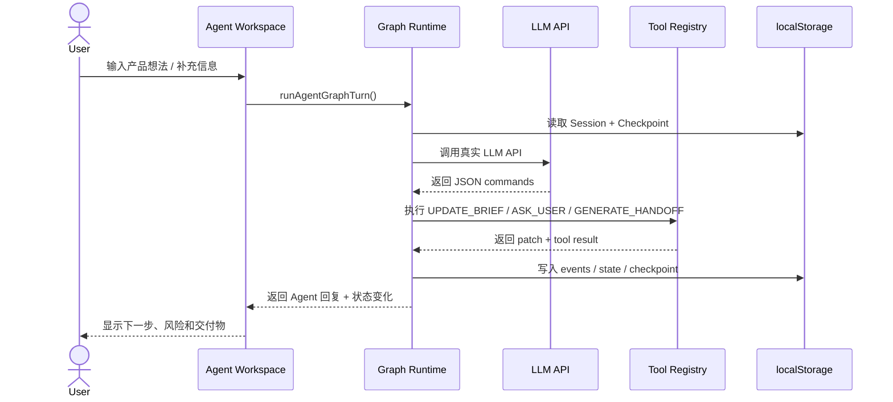

# Vibe Decision Copilot

> **在 AI 写代码之前，先把"想法"变成"图纸"。**

<p align="center">
  
  
  
  
</p>

---

## 一句话理解这个项目

**Vibe Decision Copilot** 是一个面向 vibe coding 新手的**前期决策 Agent**。

它不直接替你写代码，而是在 AI 写代码之前，先帮你把一句模糊想法整理成：

```
"我想做一个 AI 工具"
    ↓
可判断的问题定义
→ 可收敛的 MVP 范围
→ 可验证的验收标准
→ 可交给 Codex / Claude Code / Cursor 执行的开发任务包
```

---

## 用类比理解它

### 类比 1：建筑师 vs 施工队

想象你要盖一栋房子。

你不会对施工队说"帮我盖个房子"就完事了。你需要先找**建筑师**画图纸：盖几层、给谁住、先盖哪些房间、哪些暂时不盖、什么样算验收合格。

**Vibe Decision Copilot 就是那个建筑师。**

它在 Codex / Cursor 这些"施工队"开工之前，先把你的想法变成施工图纸（DEV_SPEC + CODEX_TASK_PACK）。

### 类比 2：菜谱 vs 厨师

你不会让厨师在不知道你要做什么菜的情况下就开始烹饪。

你需要先写**菜谱**：做什么菜、需要哪些食材、每一步怎么做、什么样算做好了。

**Vibe Decision Copilot 就是那个帮你写菜谱的工具。**

它在 AI "厨师"开始"做菜"（写代码）之前，先把菜谱写清楚。

### 类比 3：GPS vs 盲开

你不会在不知道目的地的情况下上高速。

你需要先输入目的地，让 **GPS** 规划路线：走哪条路、预计多长时间、哪里有收费站、哪里可能堵车。

**Vibe Decision Copilot 就是那个 GPS。**

它在你"上路"（开始开发）之前，先帮你规划好路线。

### 类比 4：医生诊断 vs 直接开药

你不会对医生说"我不舒服，给我开药"就完事了。

医生会先**诊断**：哪里不舒服、什么时候开始的、有没有过敏史、需要做什么检查，然后才开药。

**Vibe Decision Copilot 就是那个先诊断再开药的医生。**

它在 AI "开药"（生成代码）之前，先帮你"诊断"清楚问题。

---

## 核心流程：从雾到图纸

```
Raw Idea：        一团雾        "我想做一个雅思小程序"
    ↓
Problem：         轮廓出现      "雅思学生复盘生词和错题很分散"
    ↓
Scenario：        场景落地      "做完剑桥真题后整理词块、同替和错因"
    ↓
MVP：             削掉多余      "只做词库 + 错题 + 复盘闭环，不做社区/支付/登录"
    ↓
Acceptance：      标尺出现      "用户能新增、分类、导出、复盘，才算完成"
    ↓
CODEX_TASK_PACK： 图纸完成      "Codex 可以按步骤改代码"
```

---

## 为什么需要它？

很多 vibe coding 项目失败，不是因为 AI 不会写代码，而是因为人在开始前没有想清楚：

| 常见问题 | 最终结果 |
|---|---|
| "我想做一个 AI 工具"太模糊 | AI 只能生成玩具 Demo |
| 没想清楚目标用户 | 页面有了，但没人真的需要 |
| 没有 MVP 范围 | 第一版越做越大，最后失控 |
| 没有反证和风险判断 | 项目看起来完整，但逻辑不成立 |
| 没有验收标准 | Codex 不知道做到什么程度算完成 |
| Prompt 太散 | AI 编程工具执行不稳定 |

**一句话：**

> 对 AI 产品来说，最可怕的不是失败，而是假装成功。

---

## 它和普通 PRD 生成器有什么不同？

| 对比项 | 普通 PRD 生成器 | Vibe Decision Copilot |
|---|---|---|
| 工作方式 | 一次性生成文档 | 10 阶段渐进式决策 + 人类确认 |
| 重点 | 文档看起来完整 | 需求是否值得做、能否执行 |
| 风险处理 | 往往缺失 | 强制加入反证和盲点 |
| MVP 控制 | 容易大而全 | P0 / P1 / P2 / Out of Scope |
| 面向对象 | 产品文档阅读者 | AI Coding 执行工具 |
| 最终交付 | PRD 文本 | DEV_SPEC + CODEX_TASK_PACK |

**一句话：**

> 普通 PRD 生成器像"帮你写作文"；Vibe Decision Copilot 像"帮你把项目从想法审成施工图"。

---

## 10 阶段决策管道

| 进度 | 阶段 | 它在问什么 | 产出 |
|---:|---|---|---|
| 10% | Raw Idea | 你想做什么？ | 原始想法、项目类型 |
| 20% | Problem Framing | 真正问题是什么？ | 问题定义、痛点边界 |
| 30% | User Scenario | 谁在什么场景下用？ | 用户画像、使用场景 |
| 40% | Demand Evidence | 凭什么说它值得做？ | 需求证据、替代方案 |
| 55% | MVP Scope | 第一版只做什么？ | P0 / P1 / P2 / Out of Scope |
| 65% | Risk Counterargument | 什么证据能证明你错了？ | 风险、反证、失败条件 |
| 75% | Tech Constraints | 最低成本怎么实现？ | 技术栈、数据结构、边界 |
| 85% | Acceptance Criteria | 做到什么算完成？ | 可测试验收标准 |
| 95% | DEV_SPEC | 代码前的规格是什么？ | 开发规格文档 |
| 100% | CODEX_TASK_PACK | Codex 怎么执行？ | 文件计划、步骤、测试、禁止项 |

---

## 核心功能

### 1. 需求质量评分

8 维度本地规则评分（0-5 分/维度，总分 40 分）：

- **清晰度**：是否说清楚要做什么
- **具体性**：是否包含具体名词/数字/场景
- **用户证据**：是否有用户/场景/需求证据
- **范围控制**：是否有 P0/P1/P2/Out of Scope
- **可测试性**：是否可验收
- **技术可行性**：是否定义了技术约束
- **风险意识**：是否有反证和风险分析
- **Codex 可执行性**：是否能交给 Codex 执行

### 2. 需求歧义检测

自动识别 5 类模糊表述：

- 模糊量词："很多"、"一些"、"大部分"
- 空洞形容词："好用"、"智能"、"强大"
- 泛词："智能化"、"自动化"、"平台化"
- 无边界范围："所有用户"、"全平台"
- 口语化表述："做一个"、"搞一个"

每个检测附带具体的澄清追问。

### 3. MVP 范围控制

- P0/P1/P2 功能分级
- Out of Scope 明确定义
- Scope Creep 预警（检测到登录/支付/团队协作等膨胀词时自动提醒）
- P0 数量收敛建议（≤5 个）

### 4. EARS 验收标准

5 种 EARS 模板生成结构化验收标准：

- **Ubiquitous**：系统始终满足的行为
- **Event-driven**：事件驱动的响应
- **State-driven**：状态驱动的行为
- **Optional**：可选功能
- **Unwanted**：V1 明确不做的功能

### 5. CODEX_TASK_PACK

最终交付给 Codex 的不是一段泛泛的 Prompt，而是一份可执行任务包：

```
CODEX_TASK_PACK
├── Context：当前项目背景
├── Objective：本轮要实现什么
├── Constraints：不能改什么
├── File Plan：预计修改哪些文件
├── Implementation Steps：分步骤执行
├── Acceptance Tests：验收测试
├── Forbidden Changes：禁止事项
└── Progress Checklist：带百分比的执行清单
```

---

## Agent Graph Runtime

项目中有一个前端 Agent Graph Runtime。它不是"聊天框套 API"，而是维护一套可追踪的决策状态：



---

## 技术栈

| 层级 | 技术 | 说明 |
|---|---|---|
| 前端 | React 19 + TypeScript + Vite | 单页应用，适合快速迭代 |
| 路由 | React Router | 多页面流程与工作台 |
| 样式 | Tailwind CSS v4 + CSS Variables | 黑白灰 / iOS-like / 磨砂玻璃 |
| 状态 | React State + localStorage | 本地项目历史、Session、API 设置 |
| Agent | Agent V4 Graph Runtime | Session / Events / Commands / Tools |
| API | OpenAI-compatible Proxy | 同源代理转发，避免浏览器直连问题 |
| 输出 | DEV_SPEC / CODEX_TASK_PACK | 面向 AI coding 工具的交付物 |
| 部署 | Vercel / GitHub Pages | 前端静态 + Serverless API Proxy |

---

## 快速开始

```bash
# 1. 安装依赖
npm install

# 2. 启动开发环境
npm run dev

# 3. 构建
npm run build

# 4. Lint
npm run lint
```

打开 `http://localhost:5173`

---

## 配置 API

进入 `/settings`，点击「测试并保存 API」按钮。

V5.3 使用单一 Smoke Test：只发送最小 Chat Completions 请求，只要模型返回非空内容就认为 API 可用。不再需要 Long JSON / Reference Validation 全过。

---

## 项目目录

```
src/
├── types.ts                    # 核心类型定义
├── lib/                        # 工具库
│   ├── requirementQuality.ts   # 需求质量评分
│   ├── ambiguityDetector.ts    # 歧义检测
│   ├── scopeControl.ts         # 范围控制
│   ├── ears.ts                 # EARS 验收标准
│   ├── devSpecBuilder.ts       # DEV_SPEC 构建器
│   ├── codexTaskPackBuilder.ts # CODEX_TASK_PACK 构建器
│   ├── decisionLog.ts          # 决策记录
│   └── progressCalculator.ts   # 进度计算
├── components/                 # 共享组件
│   ├── ProgressBar.tsx         # 进度条
│   ├── DevSpecPreview.tsx      # DEV_SPEC 预览
│   ├── CodexTaskPackPreview.tsx # Task Pack 预览
│   └── ConfirmButton.tsx       # 确认按钮
├── pages/
│   ├── LandingPage.tsx         # 首页
│   ├── NewIdeaPage.tsx         # 新想法输入
│   ├── AgentWorkspacePageV4.tsx # Agent 工作台
│   ├── DecisionOutputPage.tsx  # 决策输出
│   ├── DeveloperHandoffPage.tsx # 开发交付
│   ├── SettingsPage.tsx        # API 设置
│   └── HistoryPage.tsx         # 历史记录
├── agent-v4/                   # Agent V4 Graph Runtime
├── api/                        # LLM 调用、API 健康、超时配置
└── index.css                   # 全局设计系统
```

---

## 一个具体例子

用户输入：

```
我想做一个雅思生词和错题管理小程序
```

系统不会直接说"好的，开始写代码"。

它会先拆：

```
目标用户：正在备考雅思、刷剑桥真题的学生
使用场景：做完阅读/听力后整理生词、同义替换和错题原因
核心问题：记录分散，复盘没有结构，无法沉淀高频错因
P0 功能：词库、错题、同替记录、复盘导出
暂不做：登录、社区、支付、AI 自动批改、复杂后台
验收标准：用户能新增、分类、搜索、导出，并完成一次复盘闭环
Codex 任务：创建数据结构、页面、交互、导出逻辑、测试清单
```

最终交付给 Codex 的不再是一句话，而是一份可执行规格。

---

## 面试讲述

> 我做的不是普通 PRD 生成器，而是一个面向 vibe coding 的前期决策 Agent。很多人用 Codex / Claude Code 写代码时失败，不是因为 AI 不会写，而是因为开发前需求不清、范围不收敛、验收标准缺失。这个项目把模糊想法转成 Problem Framing、User Scenario、MVP Scope、Risk Counterargument、Acceptance Criteria、DEV_SPEC 和 CODEX_TASK_PACK，让 AI coding 工具在更明确的规格下执行。

如果追问"技术难点是什么"：

```
1. 如何让 LLM 稳定返回结构化 JSON
2. 如何判断输出是否真的基于用户当前想法
3. 如何避免 Agent 重复追问同一问题
4. 如何把聊天结果转成可执行 command / tool result
5. 如何在 API 失败时不生成假结果
6. 如何把产品决策转成 Codex 能执行的任务包
```

---

## Roadmap

| 阶段 | 方向 | 目标 |
|---|---|---|
| P0 | 前期决策闭环 | Raw Idea → CODEX_TASK_PACK 全流程稳定 |
| P1 | Agent 交互质量 | 更自然追问、更少重复、更强上下文感知 |
| P1 | API 诊断 | 更清晰的 timeout / JSON / validation 分层错误 |
| P2 | Real RAG | 接入产品案例、PRD 模板、架构模板检索 |
| P2 | MCP Server | 让 Codex / Claude 直接调用 Vibe Decision Copilot 工具 |
| P2 | 多模型评测 | 对比不同模型生成 DEV_SPEC 的质量 |
| P3 | 团队协作 | 账号、云端存储、协作评审、版本 diff |

---

## License

MIT

---

> Built for people who want to vibe code, but refuse to ship toy demos.
