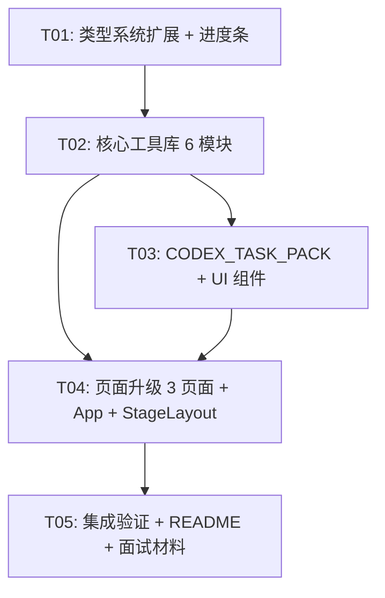

# UPGRADE_PLAN.md — VibePilot → Vibe Decision Copilot P0 升级方案

> 制定日期：2025-05-28  
> 设计者：架构师 高见远  
> 基于：ARCHITECTURE_AUDIT.md

---

## 1. P0 升级范围（13 项，逐项说明）

### 1.1 统一核心闭环数据结构

**目标**：扩展 `ProductBrief` 和 `FinalHandoff` 类型，使数据模型覆盖完整 10 阶段闭环。

**策略**：
- 在 `types.ts` 追加新类型，不删除/重命名旧类型
- 新增 `CopilotPhase` 联合类型对应 10 阶段
- `FinalHandoff` 新增可选字段（所有新字段用 `?` 标记）
- `normalizeBrief()` 中新字段不存在时返回 `undefined`，旧数据完全兼容

### 1.2 增加 DEV_SPEC / CODEX_TASK_PACK 类型定义

**目标**：定义两个新的独立交付物类型。

**DEV_SPEC**（基于已有 `StructuredDevSpec` 扩展）：
```typescript
interface DevSpec {
  projectOverview: {...};     // 项目概览
  mvpScope: {...};            // MVP 范围
  userFlow: string[];         // 用户流程
  pages: PageSpec[];          // 页面结构
  dataModels: DataModelSpec[];// 数据模型
  aiBehaviorRules: string[];  // AI 行为规则
  acceptanceCriteria: string[];// 验收标准 (EARS)
  risks: RiskItem[];          // 风险清单
  techConstraints: TechConstraint[]; // 技术约束
  generatedAt: string;        // 生成时间
}
```

**CODEX_TASK_PACK**（全新）：
```typescript
interface CodexTaskPack {
  devSpec: DevSpec;           // 关联 DEV_SPEC
  taskList: CodexTask[];      // 有序任务列表
  filePlan: FilePlanItem[];   // 文件创建计划
  setupCommands: string[];    // 初始化命令
  verificationSteps: string[];// 验收步骤
  constraints: string[];      // 实现约束
  generatedAt: string;
}

interface CodexTask {
  id: string;
  name: string;
  description: string;
  files: string[];            // 涉及文件
  dependencies: string[];     // 依赖任务 ID
  acceptanceCriteria: string[];
  priority: 'P0' | 'P1' | 'P2';
}
```

### 1.3 增加需求质量评分框架 (`src/lib/requirementQuality.ts`)

**目标**：对用户的 rawIdea 和各阶段输入做质量评分。

**评分维度**：
- 具体性 (Specificity)：是否包含具体名词/数字/场景
- 可证伪性 (Falsifiability)：是否可以被证明错误
- 完整性 (Completeness)：缺失字段百分比
- AI 价值 (AI Value)：AI 介入是否必要

```typescript
interface RequirementQualityScore {
  totalScore: number;         // 0-100
  dimensions: {
    specificity: number;      // 0-25
    falsifiability: number;   // 0-25
    completeness: number;     // 0-25
    aiValue: number;          // 0-25
  };
  missingFields: string[];
  suggestions: string[];
}
```

### 1.4 增加需求歧义检测 (`src/lib/ambiguityDetector.ts`)

**目标**：识别用户输入中的模糊表述。

**检测模式**：
- 模糊量词："很多"、"一些"、"大部分"、"比较"
- 空洞形容词："好用"、"智能"、"强大"、"友好"
- 缺失主语/宾语："提升效率"（谁的效率？什么效率？）
- 无边界范围："所有用户"、"全部功能"

```typescript
interface AmbiguityReport {
  score: number;              // 歧义分 0-100，越低越好
  issues: AmbiguityIssue[];
}

interface AmbiguityIssue {
  text: string;               // 原文片段
  type: 'vague_quantifier' | 'empty_adjective' | 'missing_subject' | 'unbounded_scope';
  suggestion: string;         // 具体化建议
}
```

### 1.5 增加 MVP 范围控制 (`src/lib/scopeControl.ts`)

**目标**：对 MVP 范围做结构化验证和膨胀检测。

**功能**：
- P0/P1/P2 分类校验：P0 不允许超过 3 个
- 范围膨胀检测：复用现有 `SCOPE_CREEP_TERMS`
- 最小闭环验证：确保 MVP 能形成完整用户流程

```typescript
interface ScopeControlResult {
  isValid: boolean;
  p0Count: number;
  hasCreep: boolean;
  creepTerms: string[];
  hasMinimumLoop: boolean;
  suggestions: string[];
}
```

### 1.6 增加 EARS 验收标准生成 (`src/lib/ears.ts`)

**目标**：将自然语言验收标准转换为 EARS (Easy Approach to Requirements Syntax) 格式。

**EARS 五种模式**：
1. Ubiquitous：`系统应 <response>`
2. Event-driven：`当 <trigger> 时，系统应 <response>`
3. Unwanted：`如果 <trigger>，那么系统应 <response>`
4. State-driven：`当 <state> 时，系统应 <response>`
5. Optional：`如果 <feature> 已启用，系统应 <response>`

```typescript
interface EarsCriteria {
  ubiquitous: string[];
  eventDriven: string[];
  unwanted: string[];
  stateDriven: string[];
  optional: string[];
}

function generateEarsCriteria(brief: ProductBrief): EarsCriteria;
function formatEarsMarkdown(criteria: EarsCriteria): string;
```

### 1.7 增加 DEV_SPEC 构建器 (`src/lib/devSpecBuilder.ts`)

**目标**：从 ProductBrief 构建结构化 DEV_SPEC（独立于 handoff 生成）。

**与现有 `spec/buildStructuredDevSpec.ts` 的关系**：
- 新的 `devSpecBuilder.ts` 会引用和包装现有的 `buildStructuredDevSpec`
- 增加 EARS 验收标准注入
- 增加技术约束结构化提取
- 增加阶段完成度标注

### 1.8 增加 CODEX_TASK_PACK 构建器 (`src/lib/codexTaskPackBuilder.ts`)

**目标**：从 DEV_SPEC 构建 Codex/Claude Code/Cursor 可执行的任务包。

**功能**：
- 从 DEV_SPEC 的 pages 和 dataModels 推导文件创建计划
- 生成有序任务列表（含依赖关系）
- 生成初始化命令（npm install / npm run dev）
- 生成验收步骤

### 1.9 增加轻量决策记录 (`src/lib/decisionLog.ts`)

**目标**：记录用户在 10 个阶段的确认/否定/跳过决策。

```typescript
interface DecisionRecord {
  phase: CopilotPhase;
  decision: 'accepted' | 'rejected' | 'modified' | 'skipped';
  timestamp: string;
  aiSuggestion?: string;
  userInput?: string;
  reason?: string;
}

interface DecisionLog {
  briefId: string;
  records: DecisionRecord[];
}
```

存储：追加到 `vibepilot_decision_logs` localStorage key，或作为 `ProductBrief.decisionLog` 字段。

### 1.10 页面层最小升级（OutputPage 恢复 + DeveloperHandoffPage 扩展）

**策略**：
- 恢复 `/output/:id` 路由 → 新建 `DecisionOutputPage`（不修改旧 `OutputPage.tsx`）
- `DeveloperHandoffPage` 底部新增两个折叠区：DEV_SPEC 预览 + CODEX_TASK_PACK 预览
- 两个预览区基于新增的 `devSpecBuilder` 和 `codexTaskPackBuilder` 生成

### 1.11 每阶段可视化进度条百分比

**目标**：在页面顶部或 StageLayout 中展示 10 阶段进度条。

**实现**：
- 在 `StageLayout` 或新的 `ProgressBar` 组件中
- 基于 `CopilotPhase` 计算当前进度
- 已完成阶段绿色，当前阶段高亮，未开始阶段灰色

### 1.12 用户确认节点机制

**目标**：在关键阶段（MVP Scope、Tech Constraints、Acceptance Criteria）增加显式确认按钮。

**实现**：
- 在每个阶段的 AiSuggestion 中已有的 `accepted` 字段
- 在决策阶段页面中突出显示"确认此决策"按钮
- 记录到 DecisionLog

### 1.13 确保 `npm run lint` / `npm run build` 通过

**要求**：升级后零 lint 错误、零 TypeScript 编译错误。

---

## 2. P1 升级范围

### 2.1 轻量版本记录

- 在 `ProductBrief` 中新增 `schemaVersion: string` 字段（默认 `'decision-copilot-v1'`）
- `normalizeBrief()` 中自动为旧数据补充 `schemaVersion: 'legacy'`
- 不强制迁移，旧数据继续可用

### 2.2 README 叙事升级

- 输出 `UPDATED_README.md`（不覆盖原 README.md）
- 叙事转向：从"面试项目"→"面向 vibe coding 新手的前期决策 Agent"
- 强调 10 阶段闭环和两个核心交付物（DEV_SPEC + CODEX_TASK_PACK）

### 2.3 面试讲述材料

- 输出 `INTERVIEW_STORY.md`
- 结构化讲述：为什么做、技术挑战、架构决策、工程亮点

---

## 3. 本轮不做事项

| 事项 | 原因 |
|------|------|
| ❌ 大规模 UI 重写 | 保持现有设计系统 |
| ❌ 接数据库/向量数据库 | 保持 localStorage-only 架构 |
| ❌ 重做整个 Agent Runtime | agent-v4 已经足够 |
| ❌ 删除旧页面 | 保持向后兼容 |
| ❌ 引入大量新依赖 | 保持 bundle 轻量 |
| ❌ 复杂登录/团队协作 | 超出 P0 范围 |
| ❌ 修改 Agent V4 Graph Runtime | 风险太大 |
| ❌ 修改 evaluate.ts | 2100+ 行怪兽不动 |
| ❌ 修改四步流程页面逻辑 | 保持 legacy 路径可用 |
| ❌ 增加新路由（除 `/output` 恢复外） | 不破坏现有 URL 结构 |

---

## 4. 文件级修改计划

### 4.1 新增文件（14 个）

| 文件 | 用途 |
|------|------|
| `src/lib/requirementQuality.ts` | 需求质量评分 |
| `src/lib/ambiguityDetector.ts` | 歧义检测 |
| `src/lib/scopeControl.ts` | MVP 范围控制 |
| `src/lib/ears.ts` | EARS 验收标准生成 |
| `src/lib/devSpecBuilder.ts` | DEV_SPEC 构建器 |
| `src/lib/codexTaskPackBuilder.ts` | CODEX_TASK_PACK 构建器 |
| `src/lib/decisionLog.ts` | 决策记录 |
| `src/lib/progressCalculator.ts` | 10 阶段进度计算 |
| `src/components/ProgressBar.tsx` | 进度条 UI 组件 |
| `src/components/DevSpecPreview.tsx` | DEV_SPEC 预览组件 |
| `src/components/CodexTaskPackPreview.tsx` | CODEX_TASK_PACK 预览组件 |
| `src/components/ConfirmButton.tsx` | 确认节点按钮 |
| `src/pages/DecisionOutputPage.tsx` | 新增：决策输出页 |
| `INTERVIEW_STORY.md` | 面试讲述材料 |

### 4.2 修改文件（7 个）

| 文件 | 修改内容 |
|------|---------|
| `src/types.ts` | 追加 CopilotPhase、DevSpec、CodexTaskPack、RequirementQualityScore、AmbiguityReport、ScopeControlResult、EarsCriteria、DecisionRecord 等类型 |
| `src/App.tsx` | 恢复 `/output/:id` → `DecisionOutputPage`；保持其他路由不变 |
| `src/pages/DeveloperHandoffPage.tsx` | 底部新增 DEV_SPEC 和 CODEX_TASK_PACK 折叠区（追加，不修改现有逻辑） |
| `src/pages/LandingPage.tsx` | 更新一句话定位文案和 Value Cards 文字 |
| `src/components/StageLayout.tsx` | 顶部增加 ProgressBar 组件 |
| `src/hooks/useProductBrief.ts` | normalizeBrief() 中新增 DecisionRecord[] 归一化（可选字段，旧数据兼容） |
| `README.md` | 不修改原文件，另存为 `UPDATED_README.md` |

### 4.3 不变文件（其余全部）

所有 agent-v2/v3/v4、evaluate.ts、knowledge、evaluation、spec（保留但被新 builder 引用）、trace、snapshot、prompts 等均不修改。

---

## 5. 数据结构修改计划

### 5.1 ProductBrief 扩展（向后兼容）

```typescript
// types.ts — 追加以下字段（全部可选）：
interface ProductBrief {
  // ... 现有字段保持不变

  // [NEW] P0 新增
  schemaVersion?: string;                          // 'decision-copilot-v1' | 'legacy'
  decisionLog?: DecisionRecord[];                  // 决策记录
  qualityScore?: RequirementQualityScore;          // 需求质量评分
  ambiguityReport?: AmbiguityReport;               // 歧义检测报告
  scopeControl?: ScopeControlResult;               // 范围控制结果
  earsCriteria?: EarsCriteria;                     // EARS 验收标准
  devSpec?: DevSpec;                               // 结构化 DEV_SPEC
  codexTaskPack?: CodexTaskPack;                   // CODEX 任务包
  completedPhases?: CopilotPhase[];                // 已完成的阶段
}
```

### 5.2 FinalHandoff 扩展（向后兼容）

```typescript
interface FinalHandoff {
  // ... 现有字段保持不变

  // [NEW] P0 新增
  devSpecObject?: DevSpec;                         // 结构化 DEV_SPEC
  codexTaskPack?: CodexTaskPack;                   // CODEX 任务包
  earsCriteria?: EarsCriteria;                     // EARS 验收标准
  qualityScore?: RequirementQualityScore;          // 质量评分快照
}
```

### 5.3 normalizeBrief() 兼容策略

```typescript
// useProductBrief.ts — normalizeBrief() 追加：
normalized.schemaVersion = brief.schemaVersion || 'legacy';
normalized.decisionLog = normalizeDecisionLog(brief.decisionLog);
normalized.qualityScore = normalizeQualityScore(brief.qualityScore);
normalized.devSpec = normalizeDevSpec(brief.devSpec || brief.finalHandoff?.devSpecObject);
// ... 所有新字段都先用 normalize*() 函数处理，不存在就返回 undefined
```

### 5.4 旧数据兼容验证

| 场景 | 行为 |
|------|------|
| 旧 brief 没有 `schemaVersion` | → normalizeBrief 设为 `'legacy'` |
| 旧 brief 没有 `devSpec` | → `brief.devSpec` 为 `undefined`，新组件不渲染对应区域 |
| 旧 brief 没有 `codexTaskPack` | → `brief.codexTaskPack` 为 `undefined`，新组件显示"尚未生成" |
| 旧 `FinalHandoff.devSpec` (文本) | → 保持不变，新 `FinalHandoff.devSpecObject` 为 `undefined` |
| 旧 brief 的 stages 为空 | → `qualityScore` 为 `undefined`，不触发评分 |

**核心原则**：任何新字段读取前都检查是否存在，不存在就优雅跳过。绝不抛错、不白屏。

---

## 6. 页面修改计划

### 6.1 路由变化

| 路径 | 当前 | 变更后 |
|------|------|--------|
| `/output/:id` | → 重定向到 `/handoff/:id` | → `DecisionOutputPage`（新页面） |
| 其余所有路由 | 不变 | 不变 |

### 6.2 LandingPage

- 一句话定位从 "不要把一句模糊想法直接丢给 AI 写代码" → 保持，增加副标题提到 10 阶段闭环
- Value Cards 文字微调：增加 "DEV_SPEC + CODEX_TASK_PACK" 交付物提及
- Feature pills 从 4 个改为 5 个：增加 "EARS 验收标准"

### 6.3 DeveloperHandoffPage

- 现有 7 个 TEXT_SECTIONS 保持不变
- 底部新增：
  - **DEV_SPEC 预览区**（可折叠）：展示结构化 DEV_SPEC
  - **CODEX_TASK_PACK 预览区**（可折叠）：展示任务列表 + 文件计划
- 实现方式：在现有 JSX 末尾追加，不修改现有逻辑

### 6.4 DecisionOutputPage（新页面）

- 展示完整 10 阶段闭环结果
- 进度条（全程可视化）
- 每个阶段的决策记录
- DEV_SPEC 和 CODEX_TASK_PACK 的下载按钮
- 类似 OutputPage 的极简设计

---

## 7. 风险控制

| 风险 | 缓解措施 |
|------|---------|
| **旧数据白屏** | 所有新字段用 `?`，读取前检查存在性 |
| **normalizeBrief 崩溃** | 新增 normalize*() 函数全部用 try/catch 包裹 |
| **类型爆炸** | 新类型放在 types.ts 末尾，用注释分隔 |
| **lint 失败** | 每个任务完成后立即运行 `npm run lint` |
| **build 失败** | 每个任务完成后立即运行 `npm run build` |
| **Agent V4 受影响** | agent-v4/ 一行不改 |
| **DeveloperHandoffPage 受影响** | 只在底部追加，不动现有逻辑 |
| **localStorage 膨胀** | 新字段不持久化到 localStorage（仅在内存中计算），DecisionLog 单独 key |

---

## 8. 回滚方案

如果升级出现问题：

1. **Git revert**：所有修改在独立分支 `upgrade/decision-copilot-p0` 上进行
2. **最小回滚路径**：
   - 删除新增的 `src/lib/` 文件（7 个）
   - 删除新增的 `src/components/` 文件（4 个）
   - 删除 `src/pages/DecisionOutputPage.tsx`
   - 恢复 `src/App.tsx` 路由为 redirect
   - 恢复 `src/types.ts` 到原始版本
   - 恢复 `src/pages/DeveloperHandoffPage.tsx`、`LandingPage.tsx`、`StageLayout.tsx`
3. **数据无损**：新字段都是可选的，删除代码后旧数据完美运行

---

## 9. 验收标准

### 9.1 功能验收

- [ ] `/output/:id` 展示 DecisionOutputPage，包含完整 10 阶段结果
- [ ] DeveloperHandoffPage 底部有 DEV_SPEC 和 CODEX_TASK_PACK 预览
- [ ] 质量评分框架正确计算需求完整度
- [ ] 歧义检测识别常见模糊表述
- [ ] MVP 范围控制检测 P0 超量
- [ ] EARS 验收标准生成 5 种模式
- [ ] DEV_SPEC 构建器输出结构化 spec
- [ ] CODEX_TASK_PACK 构建器输出任务列表
- [ ] 决策记录正确记录确认/否定
- [ ] 10 阶段进度条百分比正确显示
- [ ] 确认按钮在关键阶段可点击

### 9.2 兼容验收

- [ ] 旧 brief（无新字段）加载不白屏、不报错
- [ ] 旧 brief 在 DeveloperHandoffPage 正常显示（DEV_SPEC 区显示"请生成"）
- [ ] Agent V4 工作区正常工作
- [ ] 四步流程正常工作
- [ ] localStorage 旧数据完整保留

### 9.3 构建验收

- [ ] `npm run lint` → 0 errors
- [ ] `npm run build` → 成功

---

## 10. 进度条设计

```text
┌──────────────────────────────────────────────────────────────┐
│  Vibe Decision Copilot — 10 Stage Pipeline                  │
├──────────────────────────────────────────────────────────────┤
│                                                              │
│  Raw Idea                    [████████████] 100% ✓           │
│  Problem Framing             [████████████] 100% ✓           │
│  User Scenario               [████████████] 100% ✓           │
│  Demand Evidence             [████████----]  80% ●           │
│  MVP Scope                   [██████------]  60% ○           │
│  Risk Counterargument        [████--------]  40% ○           │
│  Tech Constraints            [██----------]  20% ○           │
│  Acceptance Criteria         [------------]   0% ○           │
│  DEV_SPEC                    [------------]   0% ○           │
│  CODEX_TASK_PACK             [------------]   0% ○           │
│                                                              │
│  总进度: ████████░░░░░░░░░░░░ 40% (4/10 stages complete)    │
│                                                              │
└──────────────────────────────────────────────────────────────┘
```

**状态颜色**：
- 🟢 绿色 `✓` = 已完成（用户确认）
- 🔵 蓝色 `●` = 进行中（当前阶段，AI 已生成建议）
- ⚪ 灰色 `○` = 未开始

---

## 11. 任务分解（按实现顺序）

### 约束
- 硬性上限：**不超过 5 个任务**
- 每个任务至少包含 3 个相关文件
- 任务按功能模块分组
- T01 必须是项目基础设施

---

### T01: 类型系统扩展 + 进度条基础设施

**Task ID**: T01  
**Priority**: P0  
**Dependencies**: 无  
**Source Files**:
- `src/types.ts` — 追加所有 P0 新类型（CopilotPhase、DevSpec、CodexTaskPack、RequirementQualityScore、AmbiguityReport、ScopeControlResult、EarsCriteria、DecisionRecord）
- `src/lib/progressCalculator.ts` — 10 阶段进度计算（基于 completedPhases）
- `src/components/ProgressBar.tsx` — 10 阶段进度条 UI 组件
- `src/hooks/useProductBrief.ts` — normalizeBrief() 追加新字段兼容

**内容**：
1. 在 `types.ts` 末尾追加所有新类型定义（全 `export`）
2. 在 `CopilotPhase` 中定义 10 阶段的联合类型
3. 在 `ProductBrief` 和 `FinalHandoff` 中追加新字段（全部 `?` 可选）
4. 实现 `progressCalculator.ts`：`calculateProgress(brief)` → `{completed, current, total, percentage}`
5. 实现 `ProgressBar` 组件：接收 `phases` 和 `completedPhases`，渲染 10 行进度条
6. `normalizeBrief()` 中追加 `schemaVersion`、`completedPhases` 等字段兼容

---

### T02: 核心工具库（6 个 lib 模块）

**Task ID**: T02  
**Priority**: P0  
**Dependencies**: T01  
**Source Files**:
- `src/lib/requirementQuality.ts` — 需求质量评分框架
- `src/lib/ambiguityDetector.ts` — 需求歧义检测
- `src/lib/scopeControl.ts` — MVP 范围控制
- `src/lib/ears.ts` — EARS 验收标准生成
- `src/lib/decisionLog.ts` — 轻量决策记录
- `src/lib/devSpecBuilder.ts` — DEV_SPEC 构建器（包装现有 buildStructuredDevSpec）

**内容**：
1. `requirementQuality.ts`：基于 rawIdea + ideaInput 计算 4 维度评分
2. `ambiguityDetector.ts`：正则匹配 4 类模糊表述，生成 AmbiguityReport
3. `scopeControl.ts`：检查 P0 数量、SCOPE_CREEP_TERMS、最小闭环
4. `ears.ts`：5 种模式生成 EarsCriteria + formatEarsMarkdown
5. `decisionLog.ts`：DecisionLog CRUD（localStorage key: `vibepilot_decision_logs`），addRecord/getLog
6. `devSpecBuilder.ts`：包装 `spec/buildStructuredDevSpec`，注入 EARS 验收标准和技术约束

---

### T03: CODEX_TASK_PACK 构建器 + 新建 UI 组件

**Task ID**: T03  
**Priority**: P0  
**Dependencies**: T01, T02  
**Source Files**:
- `src/lib/codexTaskPackBuilder.ts` — CODEX_TASK_PACK 构建器
- `src/components/DevSpecPreview.tsx` — DEV_SPEC 折叠预览组件
- `src/components/CodexTaskPackPreview.tsx` — CODEX_TASK_PACK 折叠预览组件
- `src/components/ConfirmButton.tsx` — 确认节点按钮

**内容**：
1. `codexTaskPackBuilder.ts`：从 DevSpec 推导 CodexTask[] + FilePlanItem[] + setupCommands + verificationSteps
2. `DevSpecPreview.tsx`：可折叠卡片，展示 DEV_SPEC 各节（Project Overview / MVP Scope / User Flow / Pages / Data Models / Risks）
3. `CodexTaskPackPreview.tsx`：可折叠卡片，展示任务列表（ID/Name/Files/Dependencies/Priority 表格）+ 命令 + 约束
4. `ConfirmButton.tsx`：带确认对话框的按钮组件（"确认此决策"→ "确认后将进入下一阶段"）

---

### T04: 页面升级（DeveloperHandoffPage + DecisionOutputPage + LandingPage）

**Task ID**: T04  
**Priority**: P0  
**Dependencies**: T01, T02, T03  
**Source Files**:
- `src/pages/DecisionOutputPage.tsx` — 新建：10 阶段闭环输出页
- `src/pages/DeveloperHandoffPage.tsx` — 修改：底部追加 DEV_SPEC + CODEX_TASK_PACK 折叠区
- `src/pages/LandingPage.tsx` — 修改：更新文案和 Value Cards
- `src/components/StageLayout.tsx` — 修改：顶部增加 ProgressBar
- `src/App.tsx` — 修改：恢复 `/output/:id` 路由

**内容**：
1. `DecisionOutputPage.tsx`：
   - 展示 10 阶段闭环结果（每个阶段的决策 + AI 建议）
   - 嵌入 ProgressBar
   - DEV_SPEC 和 CODEX_TASK_PACK 一键下载
   - 从 `/handoff/:id` 导航入口
2. `DeveloperHandoffPage.tsx`：
   - 在现有 JSX 末尾追加 `<DevSpecPreview>` 和 `<CodexTaskPackPreview>`
   - 新增"查看决策输出"按钮 → 导航到 `/output/:id`
3. `LandingPage.tsx`：
   - 更新一句话定位文案（微调，保持原风格）
   - Value Cards 第 3 张改为 "DEV_SPEC + CODEX_TASK_PACK"
   - Feature pills 增加 1 个
4. `StageLayout.tsx`：在 Header 下方增加 `<ProgressBar>`（仅当 brief 存在时）
5. `App.tsx`：`/output/:id` → `<DecisionOutputPage />`（替换原 redirect）

---

### T05: 集成测试 + README + 面试材料 + Lint/Build 验证

**Task ID**: T05  
**Priority**: P0  
**Dependencies**: T01, T02, T03, T04  
**Source Files**:
- `UPDATED_README.md` — 叙事升级（不覆盖原 README.md）
- `INTERVIEW_STORY.md` — 面试讲述材料
- 运行 `npm run lint` + `npm run build` 验证
- （可选）手动测试清单

**内容**：
1. 编写 `UPDATED_README.md`：
   - 定位转向：Vibe Decision Copilot
   - 10 阶段闭环完整呈现
   - DEV_SPEC + CODEX_TASK_PACK 交付物说明
   - 保留原有技术亮点和面试 Talking Points
2. 编写 `INTERVIEW_STORY.md`：结构化讲述材料
3. 运行 `npm run lint` 并修复所有错误
4. 运行 `npm run build` 并修复所有 TypeScript 错误
5. 手动验证：
   - 旧数据加载不白屏
   - 新页面可访问
   - Agent V4 正常工作

---

## 12. 任务依赖图



---

## 13. 文件依赖关系矩阵

```
src/types.ts                        ← T01 (修改)
src/lib/progressCalculator.ts       ← T01 (新增)
src/components/ProgressBar.tsx      ← T01 (新增)
src/hooks/useProductBrief.ts        ← T01 (修改)
     ↓
src/lib/requirementQuality.ts       ← T02 (新增)
src/lib/ambiguityDetector.ts        ← T02 (新增)
src/lib/scopeControl.ts             ← T02 (新增)
src/lib/ears.ts                     ← T02 (新增)
src/lib/decisionLog.ts              ← T02 (新增)
src/lib/devSpecBuilder.ts           ← T02 (新增，依赖 spec/buildStructuredDevSpec)
     ↓
src/lib/codexTaskPackBuilder.ts     ← T03 (新增，依赖 T02 devSpecBuilder)
src/components/DevSpecPreview.tsx    ← T03 (新增)
src/components/CodexTaskPackPreview.tsx ← T03 (新增)
src/components/ConfirmButton.tsx    ← T03 (新增)
     ↓
src/pages/DecisionOutputPage.tsx    ← T04 (新增，依赖 T01-T03)
src/pages/DeveloperHandoffPage.tsx  ← T04 (修改，依赖 T03)
src/pages/LandingPage.tsx           ← T04 (修改)
src/components/StageLayout.tsx      ← T04 (修改，依赖 T01 ProgressBar)
src/App.tsx                         ← T04 (修改)
     ↓
UPDATED_README.md                   ← T05 (新增)
INTERVIEW_STORY.md                  ← T05 (新增)
```

---

## 附录 A：10 阶段与现有页面对照

| # | 目标阶段 | 当前已有页面/代码 | 升级动作 |
|---|---------|------------------|---------|
| 1 | Raw Idea | NewIdeaPage ✅ | 增加质量评分、歧义检测 |
| 2 | Problem Framing | DemandDiscoveryPage | 无页面修改，增加评分 |
| 3 | User Scenario | ProductFramingPage | 无页面修改 |
| 4 | Demand Evidence | DemandDiscoveryState 中 demandEvidence 字段 | 无页面修改 |
| 5 | MVP Scope | MvpScopePage ✅ | 增加 scopeControl 验证 |
| 6 | Risk Counterargument | BlindSpotReviewPage ✅ | 无页面修改 |
| 7 | Tech Constraints | TechnicalPlanningPage ✅ | 无页面修改 |
| 8 | Acceptance Criteria | FinalHandoff（文本） | 增加 EARS 生成 |
| 9 | DEV_SPEC | spec/ (已有，非独立交付) | 独立化为 devSpecBuilder |
| 10 | CODEX_TASK_PACK | 🔴 缺失 | 全新构建 codexTaskPackBuilder |

## 附录 B：关键类型速查

```typescript
// 10 阶段联合类型
type CopilotPhase =
  | 'rawIdea'
  | 'problemFraming'
  | 'userScenario'
  | 'demandEvidence'
  | 'mvpScope'
  | 'riskCounterargument'
  | 'techConstraints'
  | 'acceptanceCriteria'
  | 'devSpec'
  | 'codexTaskPack';

// 阶段标签
const PHASE_LABELS: Record<CopilotPhase, string> = {
  rawIdea: '原始想法',
  problemFraming: '问题框架',
  userScenario: '用户场景',
  demandEvidence: '需求证据',
  mvpScope: 'MVP 范围',
  riskCounterargument: '风险反证',
  techConstraints: '技术约束',
  acceptanceCriteria: '验收标准',
  devSpec: 'DEV_SPEC',
  codexTaskPack: 'CODEX_TASK_PACK',
};
```
