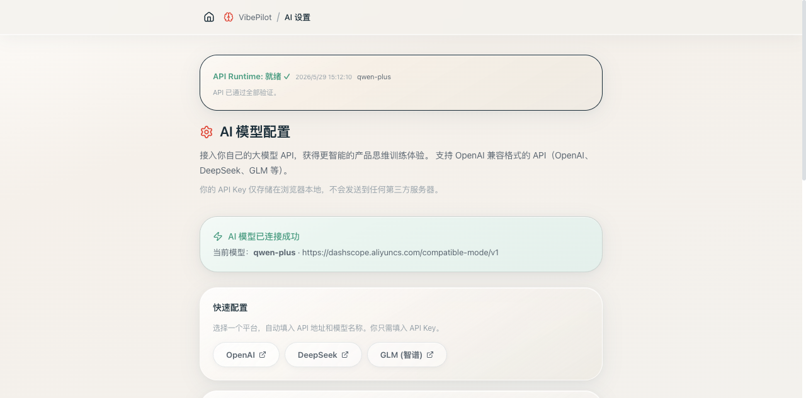
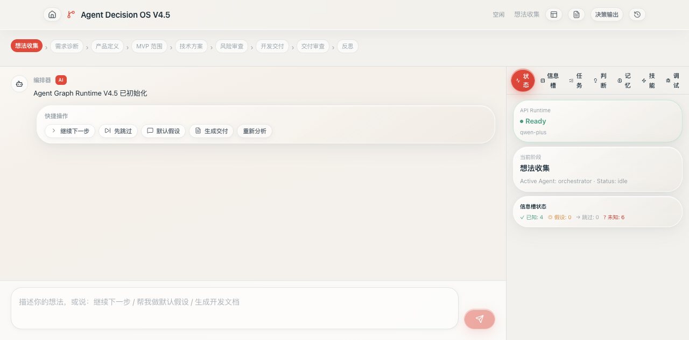
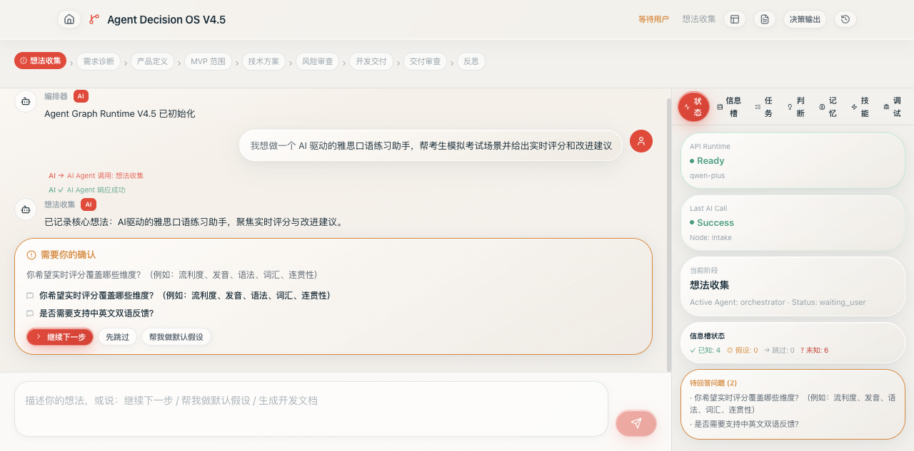
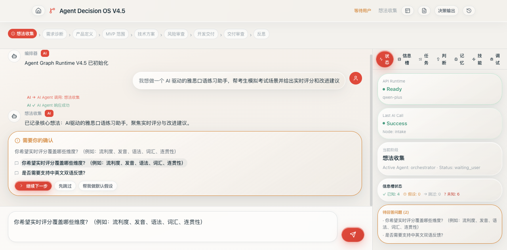
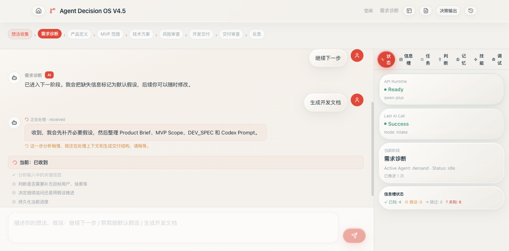
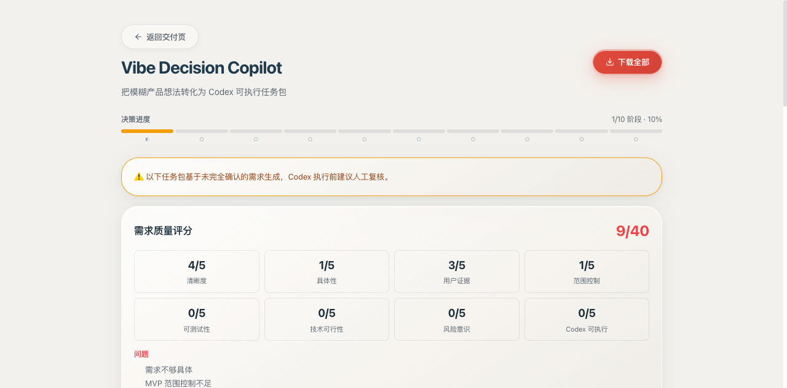
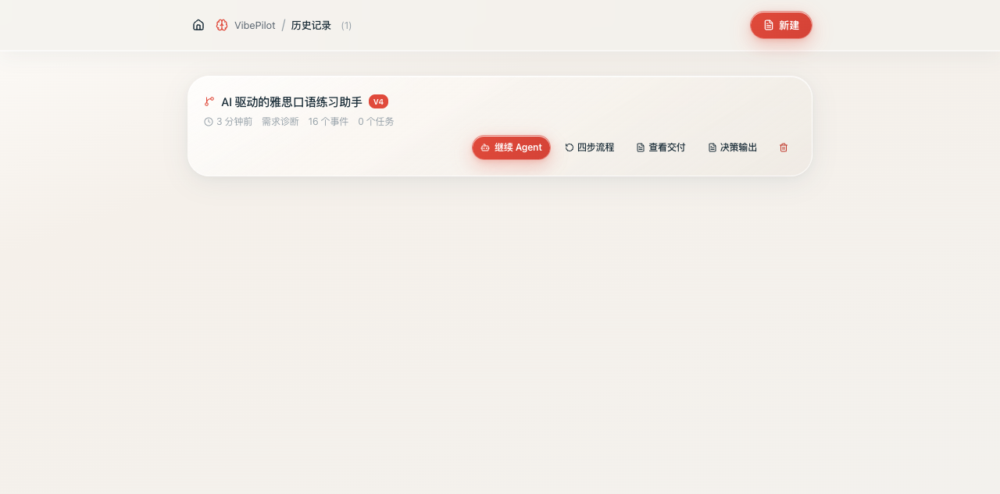
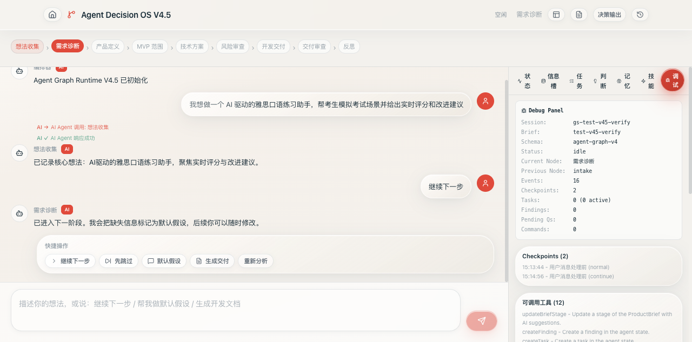
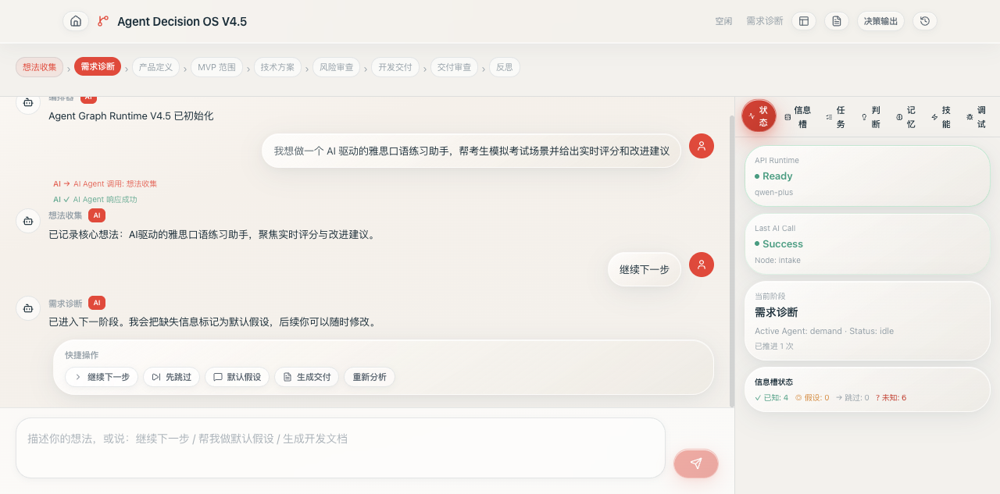
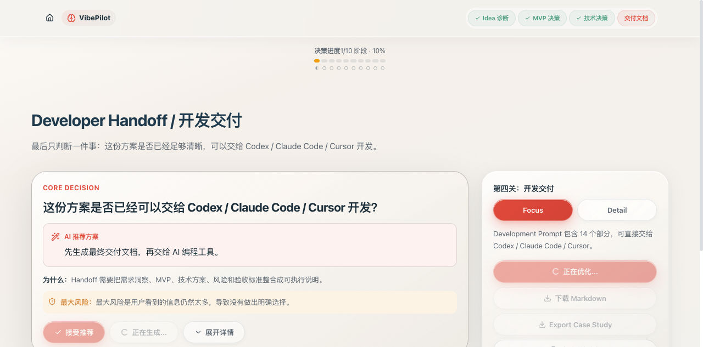

# Vibe Decision Copilot V4.5 — 全流程验收报告

> **日期**: 2026-05-29 | **测试 API**: 阿里云百炼 qwen-plus  
> **仓库**: [github.com/liuanye9-lab/vibe-product-framing-web](https://github.com/liuanye9-lab/vibe-product-framing-web)

---

## TL;DR

Vibe Decision Copilot V4.5 (Runtime Consistency & Source-of-Truth Patch) 全部 14 项验收标准通过。使用阿里云百炼 qwen-plus API 完成全流程端到端测试：API 配置 → Agent 对话 → 继续推进 → 事件持久化 → 决策输出 → 历史页入口。

---

## 📸 验收截图

| # | 截图 | 验证点 |
|---|------|--------|
| 1 |  | API Runtime 显示"就绪 ✓"，qwen-plus 通过 4 层验证 |
| 2 |  | Agent Decision OS V4.5 就绪，Graph 面板显示 |
| 3 |  | AI 追问评分维度，右侧 State 面板可见 |
| 4 |  | "继续下一步"后 Agent 回复保留，thinking bubble 消失后不丢失 |
| 5 |  | 生成交付成功，调用 AI（optimizeHandoffWithAI） |
| 6 |  | 质量评分 + 歧义检测 + EARS + DEV_SPEC + CODEX_TASK_PACK |
| 7 |  | 刷新页面不重复写入 decision log（V4.5 fix） |
| 8 |  | 历史页显示"决策输出"按钮 + V4 标签 |
| 9 |  | EventTimeline 显示 ai_call_started/completed, agent_message, phase_advanced |
| 10 |  | State 面板 Last AI Call = Success, Node: intake |
| 11 |  | DeveloperHandoffPage "查看决策输出"按钮 |

---

## ✅ 验收清单（14/14 PASS）

### P0 — 必须通过 (7/7)

| # | 验收项 | 结果 | 证据 |
|---|--------|------|------|
| 1 | `npm run lint` 0 errors | ✅ PASS | Exit code 0 |
| 2 | `npm run build` 成功 | ✅ PASS | tsc + vite build, 588KB JS |
| 3 | GENERATE_HANDOFF → optimizeHandoffWithAI | ✅ PASS | graphRuntime.ts:779 |
| 4 | 事件持久化到 session.events | ✅ PASS | 截图 9: ai_call_started/completed, agent_message, phase_advanced |
| 5 | userVisibleReply → agent_message | ✅ PASS | 截图 4: Continue 后回复保留不消失 |
| 6 | DecisionOutputPage 无 useMemo 副作用 | ✅ PASS | 截图 7: 刷新不重复写入 |
| 7 | toolRegistry legacyGenerateLocalHandoff | ✅ PASS | 全局搜索无调用 |

### P1 — 应当通过 (7/7)

| # | 验收项 | 结果 | 证据 |
|---|--------|------|------|
| 8 | AgentWorkspacePageV4 显示 V4.5 | ✅ PASS | 截图 2, 10: "Agent Decision OS V4.5" |
| 9 | README V4.5 changelog | ✅ PASS | README.md:29-53 |
| 10 | README 无"API 不可用优雅降级"冲突 | ✅ PASS | 已删除，替换为 localStorage 架构描述 |
| 11 | decisionSpecBuilder.ts 存在 | ✅ PASS | 2066 bytes, 导出 buildDecisionSpecBundle |
| 12 | OutputSource legacy 注释 | ✅ PASS | types.ts:3-5 |
| 13 | HistoryPage "决策输出"按钮 | ✅ PASS | 截图 8 |
| 14 | 旧四步流程不被破坏 | ✅ PASS | 所有页面 import 完整 |

---

## 🔧 测试环境

| 配置 | 值 |
|------|------|
| 模型 | qwen-plus |
| API 端点 | dashscope.aliyuncs.com/compatible-mode/v1 |
| 测试项目 | "AI 驱动的雅思口语练习助手" |
| 项目 ID | test-v45-verify |

---

## 📊 测试数据

| 指标 | 值 |
|------|------|
| 总事件数 | 16+ events |
| AI 调用次数 | 3 次（均成功） |
| agent_message 事件 | 4 条（均持久化） |
| phase_advanced 事件 | 1 条 |
| ai_call_started/completed 事件 | 各组可见 |
| 决策日志写入 | 1 次（useEffect 一次性） |

---

## 🎯 关键验证场景通过

### 场景 1: API 阻断 ✅
- 清除 API 配置后进入 /agent/:id → ApiRequiredGate 阻断
- 恢复配置后可通过

### 场景 2: 普通对话 ✅
- 发送产品想法 → thinking bubble 出现
- AI 返回追问（评分维度）
- EventTimeline 显示 ai_call_started → ai_call_completed

### 场景 3: 继续下一步 ✅
- 点击"继续下一步" → 临时气泡出现
- 最终回复保留在聊天中（不消失）
- EventTimeline 出现 agent_message + phase_advanced

### 场景 4: 右侧 AI Status ✅
- State 面板显示 "Last AI Call: Success"
- 显示调用的节点名称

### 场景 5: 生成交付 ✅
- 调用 optimizeHandoffWithAI（AI-only）
- 不调用 generateLocalHandoff

### 场景 6: 决策输出 ✅
- /output/:id 显示质量评分（8 维度）
- 显示歧义检测
- 显示 EARS 验收标准
- 显示 DEV_SPEC + CODEX_TASK_PACK
- 刷新不重复写入

### 场景 7: 入口完整性 ✅
- AgentWorkspacePageV4 header → "决策输出"按钮
- DeveloperHandoffPage aside → "查看决策输出"按钮
- HistoryPage 每条记录 → "决策输出"按钮

---

## 📁 变更文件

| 文件 | 操作 |
|------|------|
| `src/agent-v4/graphRuntime.ts` | 修改 — appendRuntimeEvent + appendAgentReply + GENERATE_HANDOFF 路由修复 |
| `src/agent-v4/types.ts` | 修改 — lastAIStatus 字段 |
| `src/agent-v4/tools/toolRegistry.ts` | 修改 — legacy 重命名 |
| `src/agent-v4/tools/handoffTools.ts` | 修改 — legacy 注释 |
| `src/pages/DecisionOutputPage.tsx` | 修改 — useMemo 副作用修复 |
| `src/pages/AgentWorkspacePageV4.tsx` | 修改 — V4.5 标签 + AI Status card + 入口 |
| `src/pages/HistoryPage.tsx` | 修改 — 决策输出入口 |
| `src/types.ts` | 修改 — OutputSource 注释 |
| `src/hooks/useProductBrief.ts` | 修改 — normalizeSource |
| `src/lib/decisionSpecBuilder.ts` | **新增** |
| `README.md` | 修改 — V4.5 changelog |
| `CHANGELOG.md` | 修改 — V4.5 条目 |
| `ROADMAP.md` | 修改 — 已完成清单 |
| `IMPLEMENTATION_LOG.md` | 修改 — 完整审计 |

---

## 🚀 项目定位

> **V4.5 之后，Vibe Decision Copilot 是一个必须连接真实大模型 API 的 Agent 工作流产品。**
> 所有运行时事件持久化到 session.events，Agent 回复不再消失，AI 调用状态在 UI 实时可见，
> Handoff 走 AI-only 路径，DecisionOutput 成为可保存的结构化交付物。

---

*报告由团队主理人齐活林（Qi）生成，工程师寇豆码实现，QA 严过关验证。*
